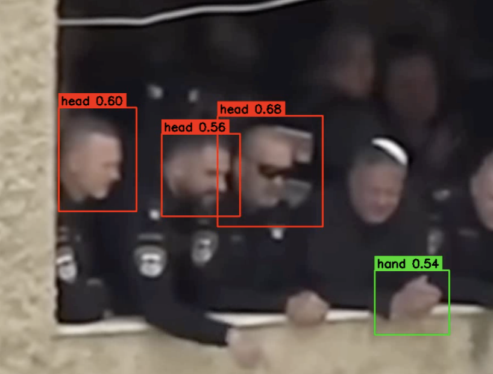

# Rescue360 – Real-Time Body Parts Detection for Search & Rescue

## Overview

Rescue360 is a computer vision system designed to assist search-and-rescue teams in locating trapped victims in disaster environments.

The system uses a custom-trained YOLOv8 model to detect visible human body parts in real-time video streams captured by standard cameras or 360° cameras such as the Insta360 X4.

The project was developed as part of a larger research and development effort focused on creating an offline-capable mobile rescue solution that can assist first responders in identifying potential survivors in collapsed structures, rubble fields, and disaster zones.
## Demo

### Live Detection Example



The image above shows the system detecting visible human body parts in a video frame and drawing bounding boxes with confidence scores.

---
---

## Project Goal

During disaster response operations, rescuers often need to inspect large areas quickly while searching for signs of trapped individuals.

This project aims to automate part of that process by:

* Detecting human body parts in real-time
* Highlighting potential victims
* Supporting live video streams
* Supporting recorded video analysis
* Enabling future deployment on Android devices using TensorFlow Lite
* Reducing search time and increasing situational awareness

---

## Supported Classes

The model is trained to detect the following classes:

| Class  | Description     |
| ------ | --------------- |
| hand   | Human hand      |
| arm    | Human arm       |
| head   | Human head      |
| leg    | Human leg       |
| foot   | Human foot      |
| person | Full human body |

---

## System Architecture

```text
Camera / Insta360
        │
        ▼
Client Application
(OpenCV)
        │
        ▼
FastAPI Detection Server
        │
        ▼
YOLOv8 Model
        │
        ▼
Bounding Boxes + Confidence Scores
        │
        ▼
Live Visualization
```

---

## Technologies Used

### Computer Vision

* YOLOv8
* OpenCV
* NumPy

### Backend

* Python
* FastAPI
* Uvicorn

### Streaming

* WebRTC (prototype)
* HTTP image streaming

### Deployment

* Local server deployment
* Cloud deployment support
* Android TensorFlow Lite deployment (planned)

---

## Features

### Real-Time Detection

* Live camera processing
* Asynchronous inference
* Low-latency visualization
* Confidence score display

### Video Processing

* Analyze recorded videos
* Save annotated output videos
* Generate visual detection results

### Camera Support

* Built-in laptop cameras
* USB webcams
* Insta360 X4
* AVFoundation camera devices (macOS)

### Streaming

* Browser-based viewing
* WebRTC prototype
* Multi-client architecture

---

## Dataset

The model was trained on a custom body-parts dataset created specifically for disaster-response scenarios.

### Dataset Characteristics

* Thousands of annotated body-part instances
* Positive and negative samples
* Real-world rescue-like environments
* Multiple body-part classes
* Background-only images to reduce false positives

### Training Classes Distribution

| Class  | Objects |
| ------ | ------: |
| Hand   |   1000+ |
| Arm    |    700+ |
| Head   |    800+ |
| Leg    |    700+ |
| Foot   |    600+ |
| Person |    500+ |

---

## Model Performance

Best validation results achieved during training:

| Metric    | Value |
| --------- | ----: |
| Precision |  0.90 |
| Recall    |  0.88 |
| mAP@50    |  0.93 |
| mAP@50-95 |  0.49 |

Inference speed:

| Environment        | Approximate Speed |
| ------------------ | ----------------: |
| Apple M4 Pro       |  ~14 ms per image |
| Local server       |         Real-time |
| Android deployment |  Under evaluation |

---

## Installation

### Clone Repository

```bash
git clone https://github.com/OmerBender/Rescue360-BodyParts-Detection.git

cd Rescue360-BodyParts-Detection
```

### Install Dependencies

```bash
pip install -r requirements.txt
```

---

## Running the Detection Server

Start the FastAPI inference server:

```bash
python -m uvicorn server:app --host 0.0.0.0 --port 8000
```

Server endpoint:

```text
http://127.0.0.1:8000/detect
```

---

## Running Live Detection

### Laptop Camera

Open:

```python
VIDEO_SOURCE = 0
```

Run:

```bash
python client_video_live_async.py
```

---

### Insta360 Camera

1. Connect the Insta360 X4 via USB.
2. Enable Webcam Mode.
3. Verify camera availability:

```bash
python preview_cameras.py
```

4. Set the detected camera index:

```python
VIDEO_SOURCE = 1
```

5. Start live detection:

```bash
python client_video_live_async.py
```

---

## Running Detection on a Video

Set:

```python
VIDEO_SOURCE = "your_video.mp4"
```

Run:

```bash
python client_video_live_async.py
```

or

```bash
python client_video.py
```

---

## Project Files

```text
server.py
    FastAPI inference server

client_video_live_async.py
    Real-time asynchronous client

client_video.py
    Video inference client

client_video_save.py
    Save annotated videos

client_visual.py
    Visualization utilities

preview_cameras.py
    Camera discovery tool

webrtc_poc/
    Browser streaming prototype
```

---

## Future Work

* Android application deployment
* TensorFlow Lite optimization
* On-device inference
* Multi-camera support
* Victim tracking
* Small-object detection improvements
* Rescue analytics dashboard

---

## Authors

**Omer Bender**

Computer Science Student
Machine Learning & Computer Vision Developer

**Eithan Shaoat**

Project Contributor

---

## Disclaimer

This project is intended for educational, research, and prototype rescue-assistance purposes. It is not certified for operational emergency use.
